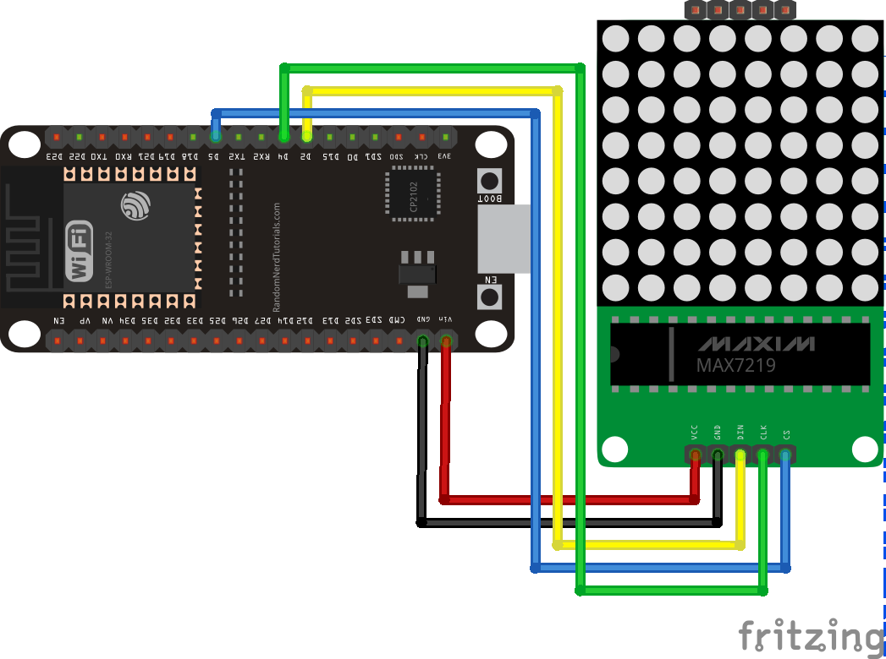

# esp32-led-matrix
Contoh penerapan led matrix 8x8 untuk board esp32 menggunakan micropython



> Format fritzing dapat didapatkan di [sini](esp32-led-matrix.fzz)

## Wiring
ESP32            | max7219 8x8 LED Matrix
---------------- | ----------------------
5V               | VCC 
GND              | GND
D2 MOSI          | DIN
D5 CS            | CS
D4 SCK           | CLK

## Langkah-langkah installasi
1. `pip install --upgrade micropy-cli`
2. `micropy stubs search esp32`
    ```
    MicroPy  Searching Stub Repositories...

    MicroPy  Results for esp32:
    MicroPy  esp32-micropython-1.10.0
    MicroPy  esp32-micropython-1.11.0
    MicroPy  esp32-micropython-1.12.0 (Installed)
    MicroPy  esp32-micropython-1.9.4
    MicroPy  esp32-pycopy-1.11.0
    MicroPy  esp3
    ```
3. `micropy stubs add <NAME_STUB>`, misalkan `esp32-micropython-1.12.0` yang akan digunakan berarti `micropy stubs add esp32-micropython-1.12.0`
4. `micropy init`
5. `micropy install <PACKAGE_NAMES>`, optional ketika ingin install paket yang dibutuhkan. misalkan install paket `picoweb`, `micropy install picoweb`
